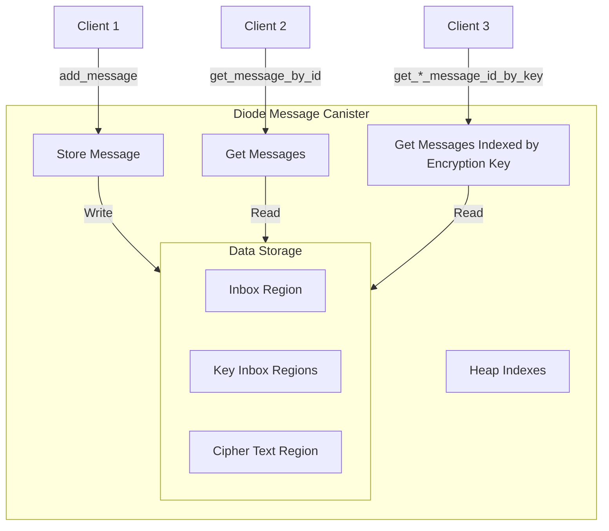
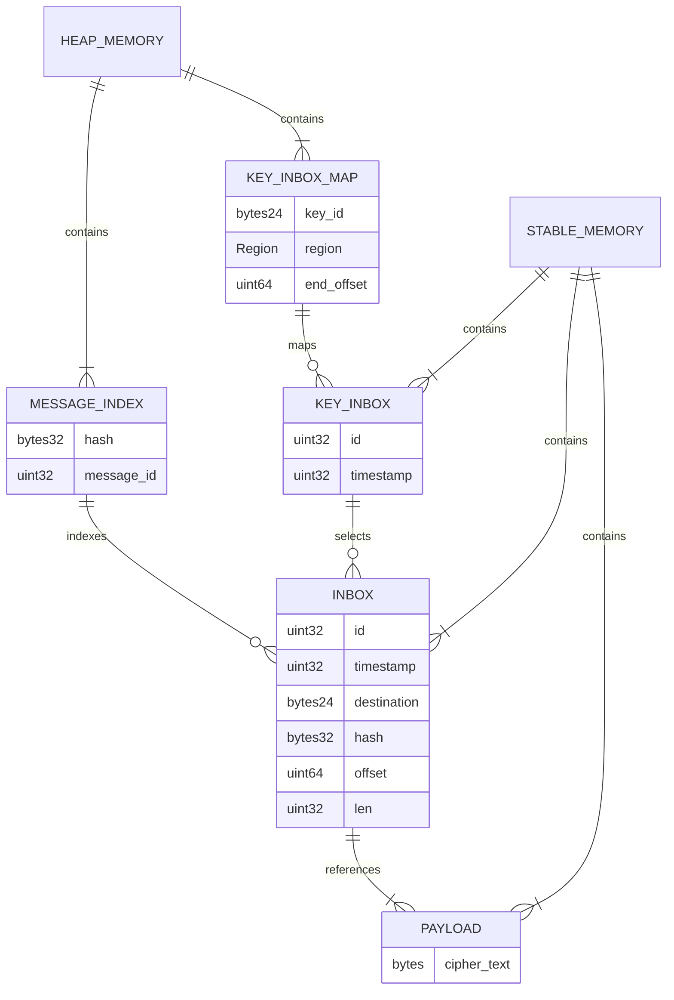

# Diode Message Canister - Milestone 1 Architecture

This canister is used as availability guarantee for the Diode peer to peer messaging system. When a peer tries to send a message to another peer which is currently offline the Canister will be used as temporary storage.

## Requirements

On average the size of a diode message is 236 bytes. This includes meta messages for key rotation and discovery as well as real user input based messages. Including the cipher text of 180 bytes and 32 bytes for the hash and 24 bytes for the key id.

- The canister should be able to store up to 1 million messages (236 mb)
- The messages primary key should be a hash of the message, so that no message is duplicated
- The messages should be indexed with tags (e.g. channel, group or similar)
- The messages should be stored in a ring buffer, so that old messages can be overwritten

## Architecture

Overview of the canister interface:

The canister will be made out of one actor implemented in Motoko. The actor will be responsible for all interactions with the outside world. To leverage the stable storage the new [Region Memory API](https://internetcomputer.org/docs/current/motoko/main/base/Region) will be used.

As of time of writing the ic allows storing 4gb "heap memory" as well as 400gb "stable storage" (https://internetcomputer.org/docs/current/developer-docs/smart-contracts/maintain/resource-limits). On upgrade of an actor the Motoko runtime will serialize "stable" structures into stable storage" and restore after the upgrade the state into "heap memory". Discussion on the forum indicates that this can be a costly process effectively limiting the maximum usable "heap memory" to 2gb as greater values lead to execution timeouts during code upgrades.

To work around this limitation the canister logic will work both with "heap memory" and a "stable storage". The "heap memory" will be used for hash tables needed for indexes and similar data structures. The "stable storage" will be used for the actual flat message storage.

In the following the message storage layout based on using the Motoko Region API will be described.

### Indexes

There are two primary indexes that need to be created:

| Index Name | Key | Value | Description |
|------------|-----|-------|-------------|
| Hash Index | hash (32 bytes) | message id (4 bytes) | Maps the message hash to its location in the inbox region and its auto incremented id there |
| Key ID Index | key_id (24 bytes) | (region, end_offset) | Maps the encryption key id to its corresponding key_inbox region and the offset at the end of the region. |

The hash index will be used to ensure that no message is duplicated in the system. It will allow for a direct access to a specific message in the inbox region. This is going to be the largest index as it needs to store the hash of every message. (1 million entries)

The key id index will be used to find the correct region for a given key_id and thus read only messages for a given key. The number of entries here is proportional to the number of active users in a diode message zone. (10k entries)

### Data layout

As there can be multiple regions and regions can be grown independently we will use one region for the dynamicly sized cipher text and two independent regions for primary (non grouped) message inbox and the sub inboxes per key_id:

- `inbox` will store all metadata for all messages in insertion order.
- `key_inbox[key_id]` is a group of regions partitioning the `inbox` content by destination address.
- `payload_region` will store the variable length message cipher text.

To keep track of the number of `key_inboxes` and a mapping between their 24 byte `key_id` and the actual `key_inbox` region we will use a (StableHashMap)[https://github.com/canscale/StableHashMap].

## Binary layout of `payload_region`

| Field       | Type   | Description                                                         |
| ----------- | ------ | ------------------------------------------------------------------- |
| cipher_text | binary | encrypted message, length given in `len`                            |

The cipher text is encrypted using the (BitMessage encryption)[https://wiki.bitmessage.org/index.php/Encryption]

## Binary layout of `inbox`

Each `inbox` entry is 76 bytes size allowing fast binary search based on timestamp and direct calculation
of an `inbox` entry location based on the `id` field. Id are guaranteed to be incrementing by one per entry.
In the future the `id` field might be used to support a ring buffer layout for the inbox field to prevent
growth beyond limits.

| Field       | Type    | Description                                                         |
| ----------- | ------- | ------------------------------------------------------------------- |
| id          | uint32  | auto incremented integer and unique id of this message              |
| timestamp   | uint32  | unix timestamp of the insertion into the canister                   |
| key_id      | bytes24 | ethereum address hash of the destination key                        |
| hash        | bytes32 | sha256 hash of the cipher_text                                      |
| offset      | uint64  | offset of the message payload in the `payload_region`               |
| len         | uint32  | length of the message payload in the `payload_region`               |

## Binary layout of `key_inbox[key_id]`

Each `key_inbox[key_id]` entry is 8 bytes size similarly allowing fast binary search based
on the timestamp. The `id` field is used to reference the message in the main `inbox` region,
so that the rest of the metadata is (hash, offset, len) is not repeated.

The `key_inbox[key_id]` is an index allowing to only fetch messages from the main `inbox` region
for a given destination key.

| Field       | Type    | Description                                                         |
| ----------- | ------- | ------------------------------------------------------------------- |
| id          | uint32  | id of this message in the `inbox`                                   |
| timestamp   | uint32  | unix timestamp of the insertion into the canister                   |

## Visualization of the data relation

### Data Layout Considerations

- `inbox` (and thus `payload_region`) could be made later into a ring buffer by adding stable `head` and `tail` pointers to the actor. For this the `id` field is introduced now.
 

