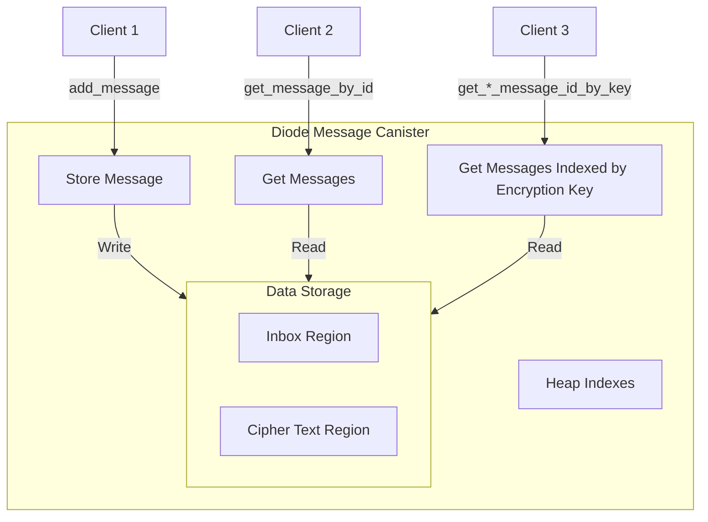
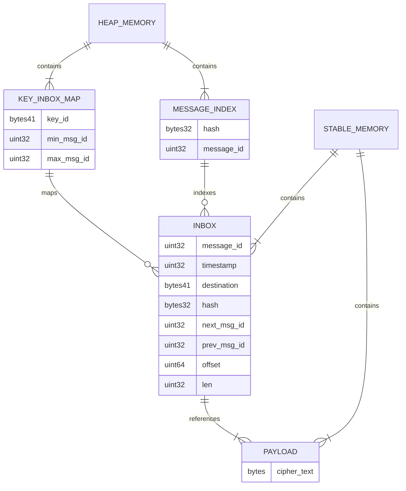

# Diode Message Canister - Milestone 1 Architecture - Amended

The MS1 architecture has been amended to address the following points:

- There is a fixed size 8mb overhead for each allocated Region (https://forum.dfinity.org/t/region-api-8mb-stable-overhead-per-region/35750). With this overhead having one Region for every key_id index is not scalable. Instead the key_id indexes are changed to be a linked list within the inbox region.

The key_id index will point to the first and last id entry still allowing for the same interface. 

## Changed Architecture

The architecture is nearly the same as in the original architecture document. Only that the Key Inbox Regions are removed.

### Indexes

Only the Key ID Index is changed:

| Index Name | Key | Value | Description |
|------------|-----|-------|-------------|
| Key ID Index | key_id (20 bytes) | (min message id, max message id, message count) | Maps the encryption key id to the highest and lowest message id in the inbox region encrypted with this key. |

### Data layout

The `inbox` region layout changes to add a `next_id` and `prev_id` field to each message to allow for a linked list of messages per key_id.

## Binary layout of `inbox`

Each `inbox` entry is 84 bytes size allowing fast binary search based on timestamp and direct calculation
of an `inbox` entry location based on the `id` field. Id are guaranteed to be incrementing by one per entry.
In the future the `id` field might be used to support a ring buffer layout for the inbox field to prevent
growth beyond limits.

| Field       | Type    | Description                                                         |
| ----------- | ------- | ------------------------------------------------------------------- |
| id          | uint32  | auto incremented integer and unique id of this message              |
| timestamp   | uint32  | unix timestamp of the insertion into the canister                   |
| key_id      | bytes41 | group_id of the destination group                                   |
| next_id     | uint32  | id of the next message in the linked list for this key_id           |
| prev_id     | uint32  | id of the previous message in the linked list for this key_id       |
| hash        | bytes32 | sha256 hash of the cipher_text                                      |
| offset      | uint64  | offset of the message payload in the `payload_region`               |
| len         | uint32  | length of the message payload in the `payload_region`               |

## Visualization of the data relation

## Remarks

This amendment to the original architecture reduces the number of Regions from (2 + number of unique key_ids) to fixed 2 Regions. 

The downside is that the linked list of messages for a given key_id are embedded within the `inbox` region. This means that linear traversal is possible, but random access is not. So searching for a certain message timestamp within a key_id is not possible without linear traversal.