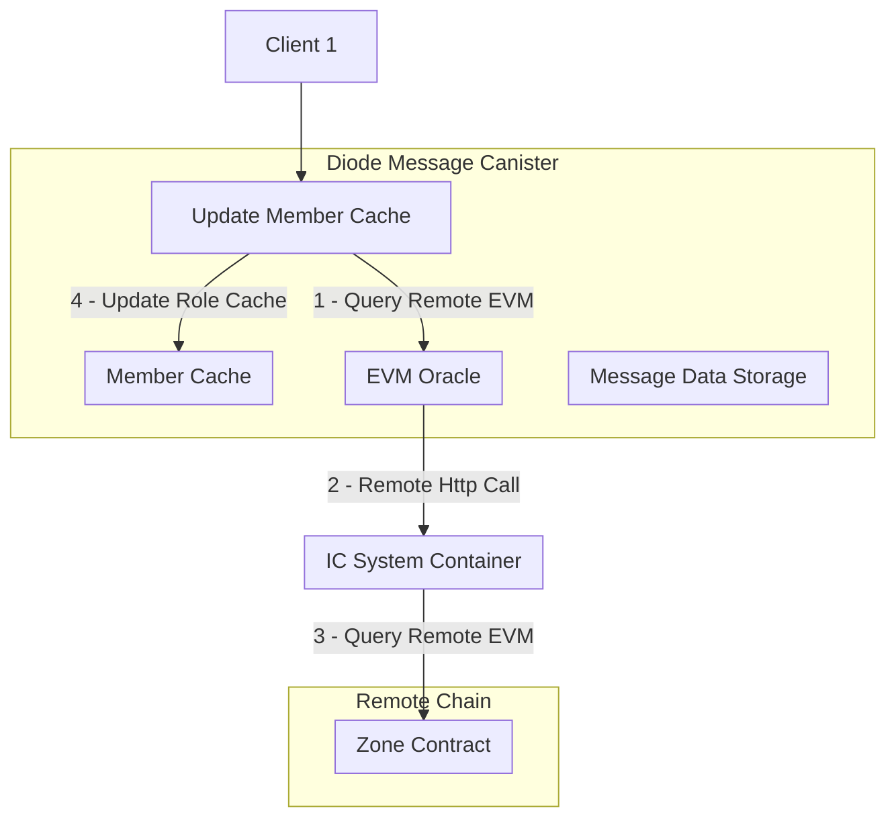
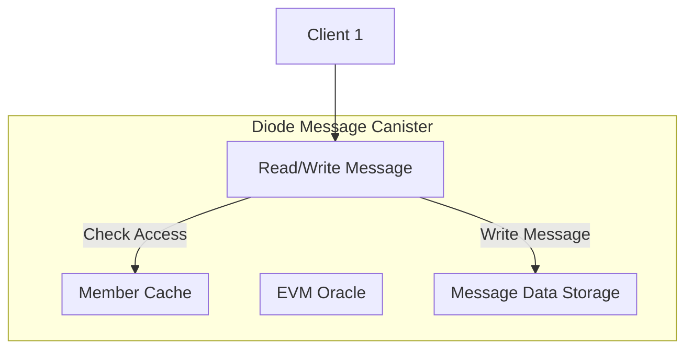

# Diode Message Canister - Milestone 2 Architecture

This canister is used as availability guarantee for the Diode peer to peer messaging system. When a peer tries to send a message to another peer which is currently offline the Canister will be used as temporary storage.

In Milestone 2 the canister will be extended to support execute permission checking before allowing clients to access or upload messages.

## Requirements

- The canister should be able to check smart contract permissions from other EVM chains
- The membership role should be stored in the canister state as cache.
- It should be possible to add new members to the zone
- It should be possible to remove members from the zone
- The canister should be chain agnostic 

## Architecture

#### Flow 1: Overview of the canister interface when fetching a members permission level from the zone smart contract cross chain.



This first flow shows how the canister can update its member cache by querying the remote EVM and then storing the fetched data in the member cache.

Initially the canister will not have any members and will need to be updated through this method. When there is no matching cache entry the member is rejected until the member cache is updated.

### Flow 2: Overview of the canister interface when checking permissions:



The second flow shows how the canister is using the member cache to check if a given message can be accessed or written. If the member cache is not updated the request is rejected as the default role value for a non-fetched member is 0.

In Motoko the member cache is checked on each protected call with this prefix:

```motoko
  public shared(msg) func add_message(key_id : Blob, ciphertext : Blob) : async Result.Result<(), Text> {
    assert_membership(msg.caller);
    ...
  };

  func assert_membership(member : Principal) {
    let role = MemberCache.get_role(zone_members, member);
    if (role == 0) {
      Debug.print("Not a member of the zone");
      assert false;
    };
  };
```

## Cross Chain Communication

The cross-chain communication between the ICP canister and EVM chains (Diode L1 or Moonbeam) is designed with several key considerations in mind:

### Lazy Loading of Member Roles

Member roles are fetched individually and only when needed, rather than loading the entire membership list upfront. This lazy loading approach is crucial for several reasons:

1. Size Constraints: Large zones could have hundreds or thousands of members, making it impractical to fetch the complete member list at once in a remote rpc request. For example:
   - The minimal membership information consists of a member's Ethereum address and role. Both values are encoded Solidity ABI using 256-bit. In the response JSON from a remote rpc call that data is encoded as hex strings weighting at least 128 bytes per member. A zone with 10,000 members, would weigh over ~1MB in the RPC response.
   - This would exceed the maximum return size of many RPC endpoints
   - It would be a single expensive operation on the canister to fetch all members and parse the returned response data, and then store it all in stable memory.
   - Zone memberships can change over time, so it could be costly to fetch the entire list repeatedly.

2. Latency Considerations: Cross-chain calls between ICP and EVM chains have significant latency:
   - Each cross-chain query takes multiple seconds to complete
   - Loading all members at once would make that much slower.

So instead of fetching entire membership lists, when the Canister is created we instead fetch minimal membership information on an as-needed basis.
  - Before using the canister the member cache is empty
  - Any user who wants to send a message to a zone needs to trigger the fetching of the minimal membership information for that user first.
  - Then the subsequent access to the canister will not have additional latency costs for the cross-chain queries.

## Address Conversion `Eth.mo`

The ICP supports multiple different Principal types, including Secp256k1 public/private key pairs. The Zone contracts hosted on EVM chains use the Ethereum address as the membership identifier. Thus when calls are made from Zone users to the Diode Message Canister, the Ethereum address needs to be derived from the Principal, so that the permission for that Ethereum address can be checked in the remote zone contract.

This address conversion is done only when the the member cache is updated, and the result is stored in the member cache. Based on the callers Principal received from `public shared(msg) ...` function calls the IC system canisters `ic.ecdsa_public_key` method is used to fetch the public key, and then hashed with Keccak-256 to generate the Ethereum address. This happens in the new `Eth.mo` module.

### Remote Zone Contract Call `Oracle.mo`

The derived Ethereum address is then used to call the Zone contract on an external EVM chain. The Solidity function `role(address user)` is called to check if the user has the necessary permissions. This happens in the `Oracle.mo` module. 

As Zones can be hosted on different EVM chains the Diode Canister is now receiving addition constructor arguments 
    - zone_id : Hex string of the Zone smart contract address
    - rpc_host : URL of the EVM chain RPC host
    - rpc_path : Any subpath after the host, for example `/api/<key>/` if needed

## Cache invalidation

As Membership roles are changing over time, and members can leave zones the member cache needs to be invalidated. This is done co-operatively by other Zone members calling the Canister's `update_member_cache` function when a member leaves a zone.

