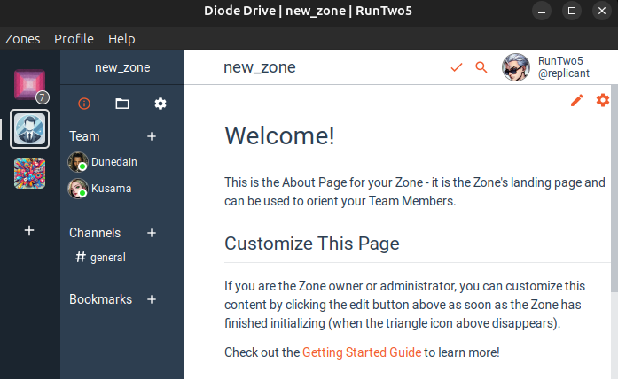
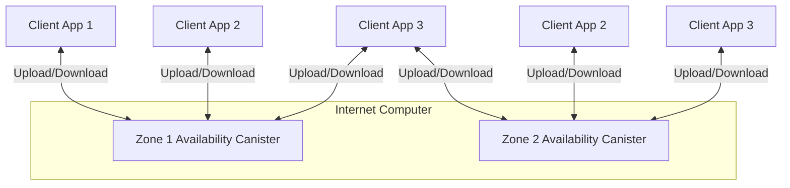

# Diode Zone Availability

Diode is a serverless P2P collaboration suite. It offers chat, file sharing, network sharing and more features usually found in centralized cloud applications such as slack, microsoft teams or discord. With it's peer to peer model similiar to BitTorrent it's decentralized and resilient. But it also has a unique availability problem compared to centralized applications when no peers are online.

This project addresses this issue by defining the Diode Zone Availability canisters to keep Diode zones data available even if no diode peer is online. For this it's using the [IC](https://internetcomputer.org/) decentralized large storage capabilities.

Currently the cost for Storing 1GiB of data on the IC is ($5.36 USD/year)[https://internetcomputer.org/docs/current/developer-docs/gas-cost#storage]. With just a fraction of this cost availability for encrypted messages can be achieved for zones improving the Diode user experience by quite a lot.

It might also be interesting to store additional file data encrypted on the IC for zones. Zone metadata like avatar pictures, zone info, etc. would add to the user experience a lot while being small enough to be stored for a long time. 

Further we would like to investigate the usage of the IC for storing all files and folders of a file sharing Diode zone. This would increase the cost quite a bit more but again might be useful for certain use cases.

# Architecture

The Diode App is structured into "Zones" each zone has it's own set of owners, members, messages, files, etc. Zones are fully isolated from each other. To map this correspondingly to the IC we define one Zone Availability Canister (ZAC) per zone. This ZAC is storing all the data for one zone.



Diagram showing the zone availability canister and multiple client apps uploading and downloading zone data:



Detailed descrptions of the Architecture in each development milestone:

- [Diode Message Cache](./docs/messages/ARCHITECTURE_MS1.md) storing 100k encrytped messages in a canister and retrieving them. 
- [Diode VetKD Store](./docs/MS1.md)

## Build Prerequisites
This project requires an installation of:

- nodejs >= 22.9
- mops https://cli.mops.one/
- DFX version 0.24.0 or newer
- The [Internet Computer SDK](https://internetcomputer.org/docs/current/developer-docs/setup/install/).

### Run the tests

```shell
$ cd diode_messages
$ mops test
```

### Local Development & Debugging

```shell
$ dfx start --background
$ dfx deploy
```
