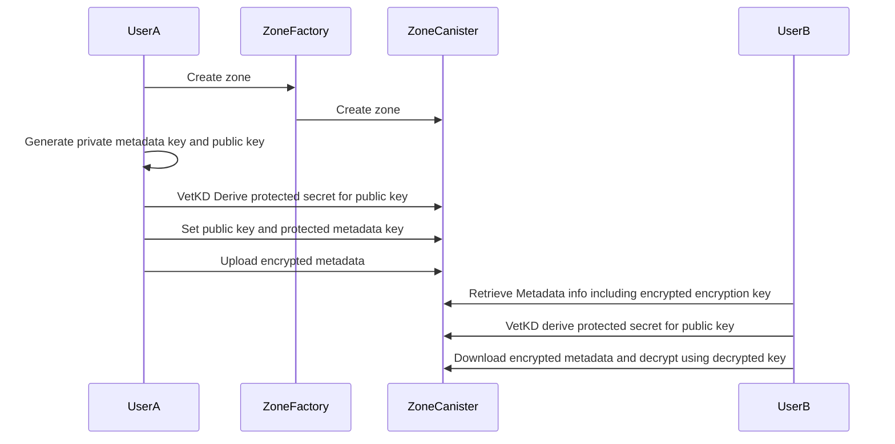

# Diode Collab: Secure File Sharing with vetKEY Integration

## MS1: Initial Implementation of Zone Canister Storage with Basic Metadata and Encryption Stubs

Diode Collab is a secure file sharing application built on the Internet Computer, leveraging vetKEY technology for end-to-end encryption and secure access control. This project implements a Zone Canister system that enables teams to securely share and collaborate on files with granular access controls.

## Metadata vetKey Usage Overview

The vetKey integration allows Zone Availability Canister to provide encrypted metadata without an apriori key exchange. This is critical at time when no user user is online.

## Sequence Diagram

To use vetKey for encryption there is an initial setup with the Canister neccesary, in which the Zone owner or Admin is generating the first public/private key pair for encryption and registering them with the Canister. Then other users (only those who have been added to the Zone) can use the deployed information plus vetKD to derive and restore the decryption keys and fetch all metadata.



### Key Components

1. **Metadata** storage  in MetaData.mo
    ```motoko
    public type DataEntry = {
        timestamp : Int;
        data : Blob;
    };

    public type MetaData = {
        var public_key : ?Blob;
        var vet_protected_key : ?Blob;
        var manifest: Nat;
        var timestamp : Int;
        storage : [var ?DataEntry];
    };
    ```
2. **vetKD Integration**: In VetKD.mo, using 'key_1' in local dfx instance with `actor ("aaaaa-aa");`
3. **Multi-layer Encryption**:
   - Data is encrypted using BitMessage scheme using a public/private key pair
   - The private key is independently generated. But encrypted using a vetKD derived token. The original key is xor encrypted using the (hashed) vetKD derived token. Allowing it to be restored only with the correct vetKD token. Errors can be checked by comparing the public key of the token.
    ```elixir
    pubkey = metadata_info.public_key
    protected_key = metadata_info.vet_protected_key
    metadata_key = sha3_256(ICP.derive_metadata_key(canister_id, pubkey))
    privkey = xor(protected_key, metadata_key)
    ```


## Deliverables
1. **Initial Canister Contract**: The MetaData.mo and VetKD.mo have been added to the ZoneAvailability repository at: https://github.com/diodechain/zone_availability_canister/ and integrated with the main deployed canisters.

2. **Unit Tests & Benchmarks**: Tests are run using the mops package manager: `mops test`

3. **vetKey client library**: There is a new Elixir based bls12_382 library for vetKey compatible point mulitplication: https://github.com/diodechain/ex_ecc and vetKey interaction directly integrated to the icp_agent https://github.com/diodechain/icp_agent in https://github.com/diodechain/icp_agent/blob/main/lib/icp_agent/vet_kd.ex

