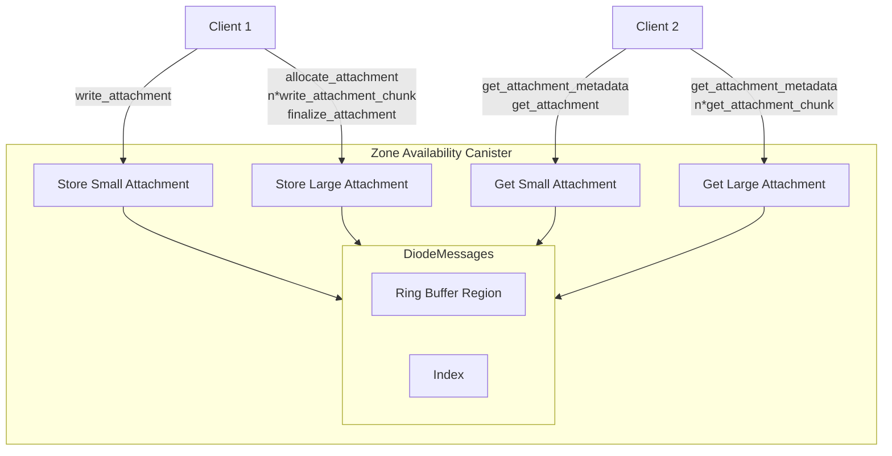

# Diode Collab: Secure File Sharing with vetKEY Integration

## MS2: Handling Encrypted Chat Attachments

Diode Collab is a secure collaboration and file sharing application built on the Internet Computer, leveraging vetKEY technology for end-to-end encryption and secure access control. This project implements a Zone Canister system that enables teams to securely share and collaborate on files with granular access controls.

## Chat Attachments Overview

Chat attachments are typically embedded images that people share when chatting, or audio files but also documents, zip files and other work related artifacts. Their size can vary from a couple of kilobytes for a screenshot to many megabytes for a large pdf document. 

While the 1st Milestone focused on vetKEY basics and small metadata, this 2nd milestone is focused on the handling of large encrypted payloads from these Chat attachments. 

## Canister Component Overview

Using the existing Zone authentication mechanism there are new member-only accessor functions for uploading and downloading attachments. 

These functions come in two flavours:

1. One-shot functions for small attachments below 1mb
2. Chunking functions for large attachments above 2mb

Depicted in the following diagram:



### Cost Control using Ring Buffer

The Attachment store is configured with `max_offset` in the region based ring. By default this is set to 128mb and will start to wrap over removing older attachments when filled up.

The goal is to allow users to configure predicable cost coming from uploading potentially many large attachments.

### Key Components

1. **Attachment** storage  in DiodeAttachments.mo
    ```motoko
    public type Attachment = {
        identity_hash : Blob;
        timestamp : Nat32;
        finalized : Bool;
        ciphertext : Blob;
    };

    public type AttachmentMetadata = {
        identity_hash : Blob;
        timestamp : Nat32;
        finalized : Bool;
        size : Nat64;
    };

    public type AttachmentStore = {
        var attachments : WriteableBand.WriteableBand;
        var first_entry_offset : Nat64;
        var end_offset : Nat64;
        var max_offset : Nat64;
        var next_entry_offset : ?Nat64;
        var hash_to_offset : Map.Map<Blob, Nat64>;
    };
    ```


## Deliverables
1. **Updated Canister Contract**: The DiodeAttachments.mo has been added to the ZoneAvailability repository at: https://github.com/diodechain/zone_availability_canister/ and integrated with the main deployed canisters.

2. **Unit Tests & Benchmarks**: Tests are run using the mops package manager: `mops test`

