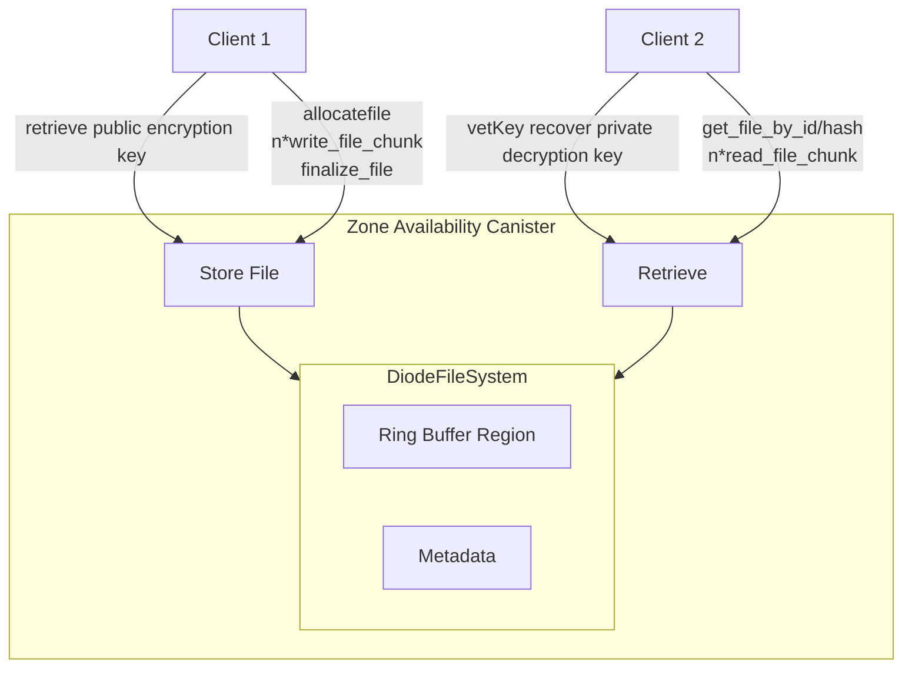

# Diode Collab: Secure File Sharing with vetKEY Integration

## MS3: Encrypted File System Storage with vetKEY protected encryption

Diode Collab is a secure collaboration and file sharing application built on the Internet Computer, leveraging vetKEY technology for end-to-end encryption and secure access control. This project implements a Zone Canister system that enables teams to securely share and collaborate on files with granular access controls.

## File System Overview

Diode Collab allows Teams to define shared file folders which are typically shared peer-to-peer between all members of the team using a bittorrent style protocol. If a member wants to access a file it is being downloaded from another team member who has this file locally. 

This system while providing full self-sovereign data management has availability challenges. When no team member is online, or most of the team is using mobile devices availability of the collected data can be low as not enough members might be online at the same time. The Internet Computer (ICP) Canister design is perfect to fill this gap. In this Milestone we start leveraging canisters to store shared files in an encrypted format so that in addition to access controls inside the canister logic, even the node operators can't read the directories or file contents.

## Canister Component Overview

In this final milestone we're re-using the architectural components of both previous milestones
- MS1: vetKey recoverable encryption keys
- MS2: Ring-buffer stored large binaries for capping max storage usage

In additional with this milestone we're adopting Motokos new **EOP: Enhanced Orthogonal Persistence**. This means there are now 6GB of heap data available for persistent Maps/Trees without needing to resort to explicit usage of "Motoko Regions". This allowed to simplify the design so that most File metadata is now living within the Motoko heap and only the raw file binary data is being stored in "Motoko Regions"

# Encryption

As MS1 a vetKey protected secret is used to encrypt a Secp256k1 private key. The private keys are created off-chain and can also be exchanged securely peer-to-peer when peers are available. When no peer is available/online the vetKey derivation can be used to recover the private key.

All file contents as well as metadata is encrypted using the `BitMessage` asymmetric encryption method. This includes:

- File names
- File size
- File timestamp
- File author signature
- Directory name
- File content

### Listing and Tracking

The FileSystem API allows both to exploratively list folders and their contents using a `get_directory` method as well tracking most recent changes using the `get_last_file_id`. This allows clients to easily stay in sync if they want to copy all files, or selectively only sync needed files.

### Access Control

Folders can be protected and shared only with certain members in a Zone. This is implemented using multiple canisters with different sets of members. Member access is checked using Chain Fusion calls to another EVM based chain. When a new private area is created - sharing a different set of members, also a new Canister is spawned isolating both access lists as well as actual storage and storage limits.

### Cost Control using Ring Buffer

Like the attachment store from MS1 the FileSystem storage is configured with a `max_offset` in the region based ring. By default this is set to 128mb and will start to wrap over removing older files when filled up.

## Deliverables
1. **Updated Canister Contract**: The DiodeFileSystem.mo has been added to the ZoneAvailability repository at: https://github.com/diodechain/zone_availability_canister/ and integrated with the main deployed canisters.

2. **Unit Tests & Benchmarks**: Tests are run using the mops package manager: `mops test` and `mops test diode_filesystem`

3. **Several Improvements to the Elixir Agent**: As we've been extending usage additional features and matureness improvements have made it's way into the public Elixir Agent for ICP: https://github.com/diodechain/icp_agent
