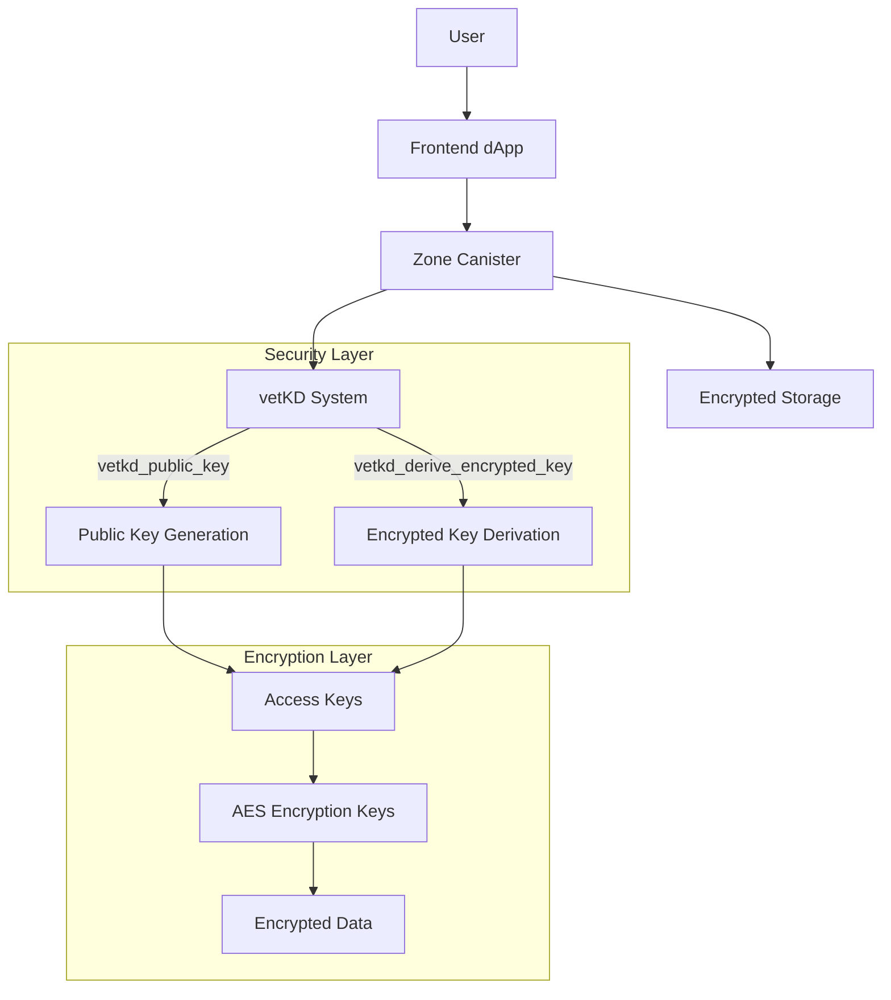
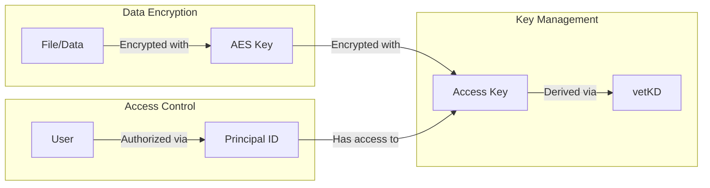
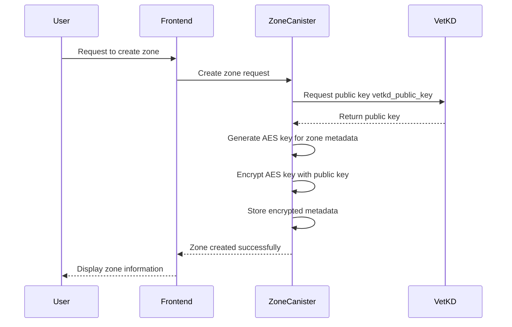
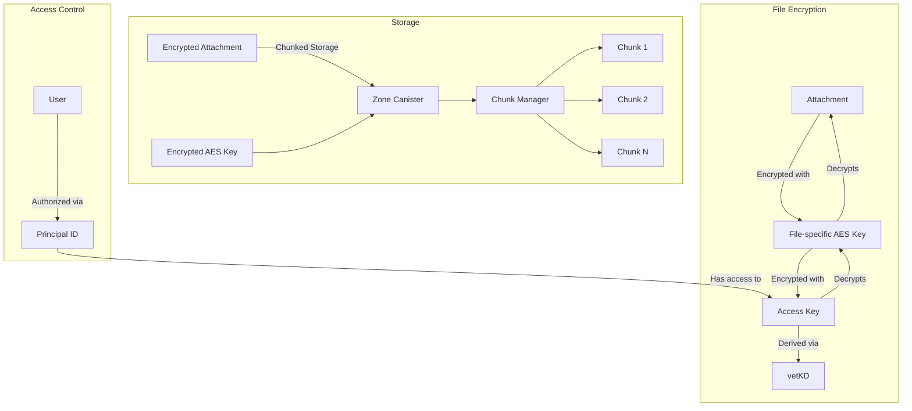
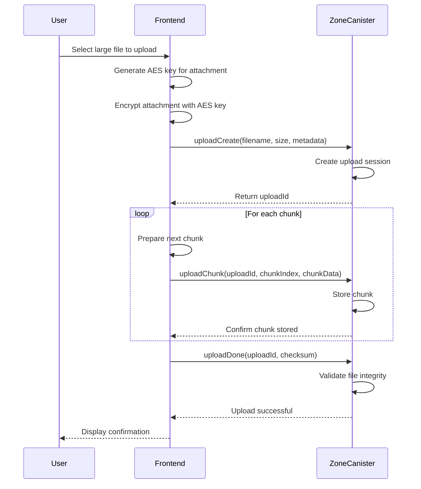
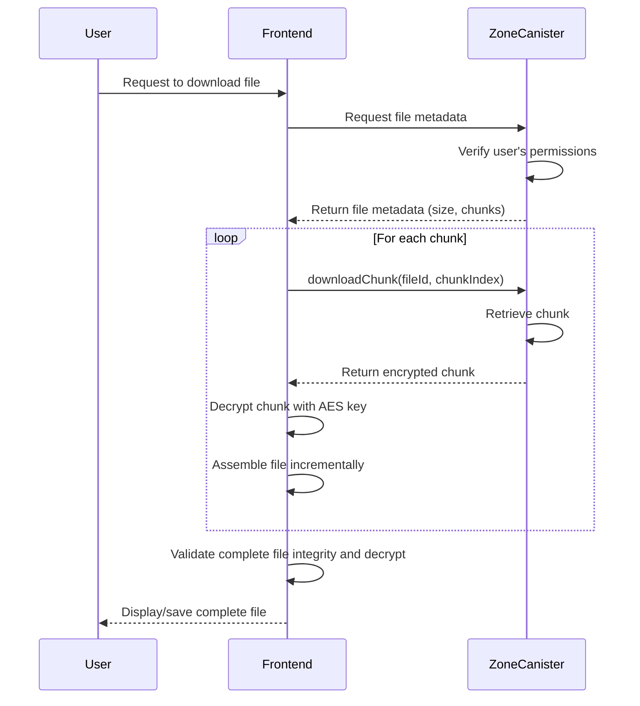
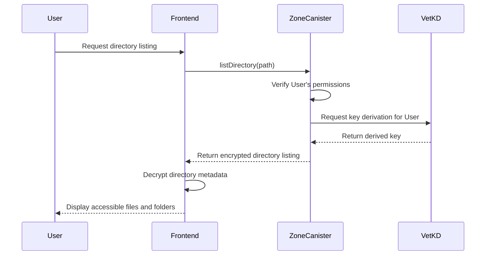
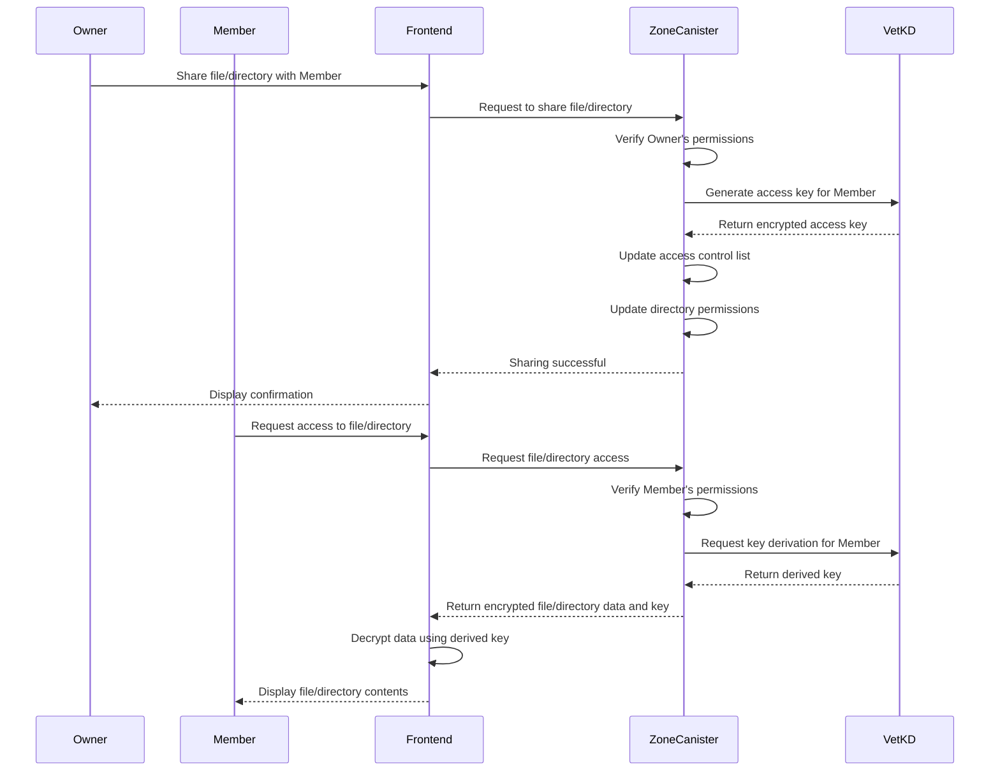
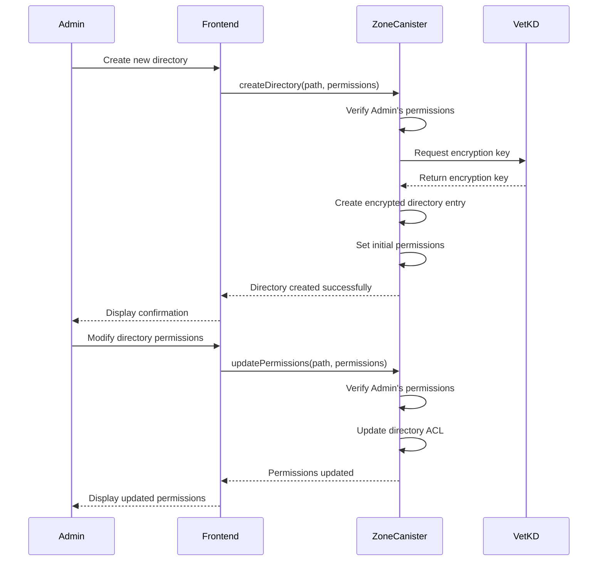
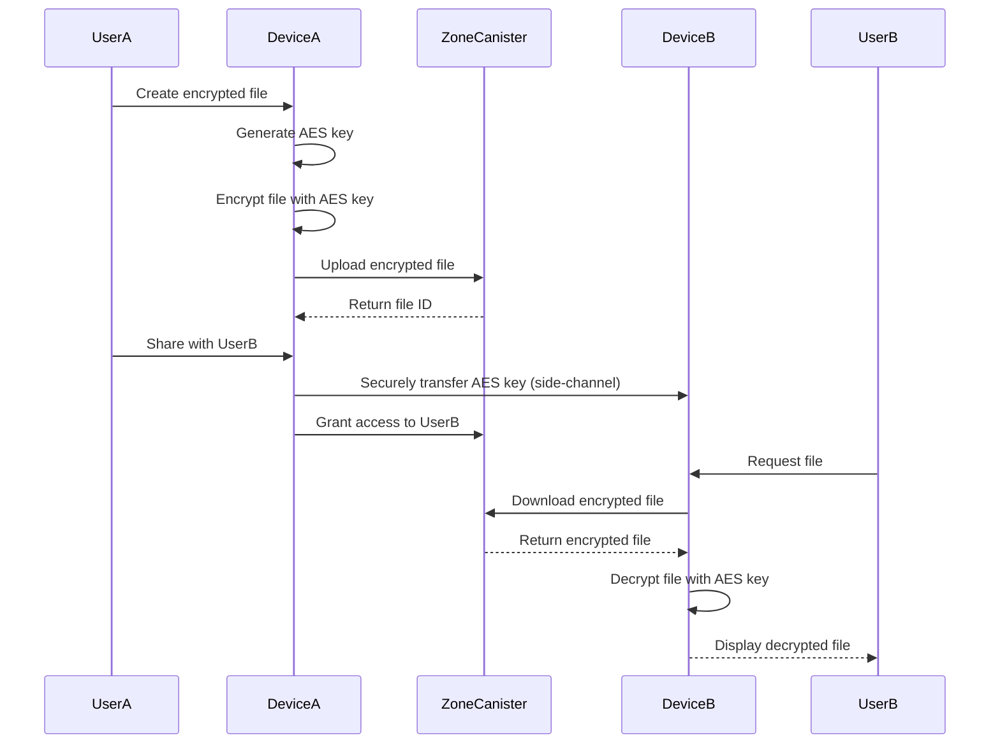

# Diode Collab: Secure File Sharing with vetKEY Integration

## Project Overview

Diode Collab is a secure file sharing application built on the Internet Computer, leveraging vetKEY technology for end-to-end encryption and secure access control. This project implements a Zone Canister system that enables teams to securely share and collaborate on files with granular access controls.

## Architecture Overview



### Key Components

1. **Zone Canister**: Manages metadata, access controls, and encrypted storage for a team workspace
2. **vetKD Integration**: Leverages the Internet Computer's vetKD system for secure key derivation
3. **Multi-layer Encryption**:
   - Data is encrypted with AES keys
   - AES keys are encrypted with access keys derived from vetKD
   - Pre-vetKD deployment: AES keys can be exchanged via secure side-channels device-to-device
   - Single key derivation on the ICP cost 0.05€, so for cost optimization data keys can be passed off-chain
   - Access key rotation can be done quickly without needing to re-encrypt the actual data as each piece of data has it's own data encryption key, and only that data encryption key needs to be re-encrypted.
   - Trusted execution environment enhancements can this way be integrated in the future when they come to the ICP

## Security Model



## User Stories

1. **Team Admin**
   - As a team admin, I want to create a secure workspace/zone where I can control who has access to shared files
   - As a team admin, I want to assign different access levels to team members (Admin, Owner, Moderator, Member, ReadOnly)
   - As a team admin, I want to define public zone metadata such as a workspace name, short description, and branding.

2. **Team Member**
   - As a team member, I want to securely upload and share files with my team
   - As a team member, I want to access files shared with me without worrying about security breaches

3. **Content Creator**
   - As a content creator, I want to share large media files (videos, images) with specific team members
   - As a content creator, I want to revoke access to my files when a team member leaves

## Milestones

---

# Milestone #1/3 – Initial Implementation of Zone Canister Storage with Basic Metadata and Encryption Stubs

## Story

This milestone focuses on the initial technical implementation of Zone Canister storage for encrypted data exchange using vetKEY encryption stubs as provided by the vetKEY integration canister. During this phase, the Zone Canister will support "zone public" metadata (such as zone name, zone logo, etc.) encrypted by a "zone shared" key. A later milestone will include transitioning to the vetKEY production ready encryption implementation and measuring cost/performance impact.

## Deliverables
- **Initial Canister Contract**: Implemented and deployable with metadata handling and encryption stubs
- **Unit Tests & Benchmarks**: Validating metadata encryption, storage, and retrieval
- **Demo Recording**: Canister deployment and basic operations
- **vetKEY client library**: New elixir agent client library to do interact with the vetKEY transport encryption using BLS12-381 curve cryptography.

## Implementation Details
- Use the vetKEY teams publicy deployed stubs for key derivation at `s55qq-oqaaa-aaaaa-aaakq-cai`:
  ```motoko
    type VETKD_SYSTEM_API = actor {
        vetkd_public_key : ({
            canister_id : ?Principal;
            derivation_path : [Blob];
            key_id : { curve : { #bls12_381_g2 }; name : Text };
        }) -> async ({ public_key : Blob });
        vetkd_derive_encrypted_key : ({
            derivation_path : [Blob];
            derivation_id : Blob;
            key_id : { curve : { #bls12_381_g2 }; name : Text };
            encryption_public_key : Blob;
        }) -> async ({ encrypted_key : Blob });
    };

    let vetkd_system_api : VETKD_SYSTEM_API = actor ("s55qq-oqaaa-aaaaa-aaakq-cai");
    ```

- Define data structures for zone metadata and access control
- Implement basic two-layer AES encryption key generation and storage

## Sequence Diagram



## Sprint 1 (Days 1-10): Core Storage Implementation with Metadata Handling
- Develop core canister logic and key validation functions
- Integrate with encryption stubs for key generation and metadata handling
- Review performance implications of encryption in canisters

## Sprint 2 (Days 11-20): Client Integration & Optimization
- Implement client side encryption/decryption of vetKEY BLS keys
- Ensure access controls hit correctly when members are being added / removed from a Zone Canister.
- Create end-to-end integrated test cases for metadata upload & downloads.

## Sprint 3 (Days 21-30): Testing & Performance Validation
- Test metadata upload and retrieval performance
- Benchmark encryption + storage efficiency and scalability
- Finalize implementation and documentation

---

# Milestone #2/3 – Handling Encrypted Chat Attachments

## Story

This milestone extends the Zone Canister to handle large chat attachments. Chat messages themselves have already been added to Canister storage. But large documents, files, images and other data that is being attached to chat messages is currently living out-of-band. In this milestone we're adding the large binary objects to the canister storage as well. This implementation ensures that attachments are securely stored and retrievable while maintaining encryption integrity.

## Deliverables
- **Attachment Storage Implementation**: Secure storage of large encrypted files
- **Chunked Upload/Download API**: Implementation of incremental file transfer for large files
- **Unit Tests & Performance Metrics**: Attachment retrieval benchmarks
- **Demo Recording**: Showing attachment storage and retrieval in action

## Implementation Details
- Define storage structure for encrypted attachments with partitioning of the data during upload and download to fit the request size limits of the ICP
- Implement attachment validation and access control
- Create chunked upload/download API to handle large files:
  - `uploadCreate`: Initialize upload and get upload ID
  - `uploadChunk`: Upload file chunks incrementally
  - `uploadDone`: Finalize upload and validate file integrity
  - `downloadChunk`: Download specific ranges of a file

## Architecture Diagram



## Sequence Diagram for Chunked Upload



## Sequence Diagram for Chunked Download



## Sprint 1 (Days 31-40): Implementation of Secure Attachment Storage
- Define canister storage structure for encrypted attachments
- Implement chunked upload/download API for large files
- Implement attachment validation and metadata handling
- Research cost impact of storing encrypted attachments

## Sprint 2 (Days 41-50): Scalability & Cost Benchmarking
- Benchmark attachment storage efficiency
- Optimize chunk size for best performance/cost balance
- Define limits for large attachments
- Implement resumable uploads for better reliability

## Sprint 3 (Days 51-60): Testing & Finalization
- Conduct security and access validation
- Optimize retrieval speed for encrypted files
- Test with various file sizes and network conditions
- Implement progress tracking and error handling
- Finalize documentation and prepare for integration

---

# Milestone #3/3 – Full vetKEY Integration & Directories

## Story

This milestone builds on top of milestones #1 and #2 applying both vetKEY gated access policies
and incremental file uploads and downloads extending them now to all shared and privately shared 
data of the zone and moving all data to the canister. Canisters should avoid too excessive gas usage 
from file storage which we will be enforcing using upload limits. Finally we switch to the ICP 
production version of vetKEYs and remove the stubs.

## Deliverables
- **Full vetKEY Integration**: All shared data is encrypted using ICP production vetKD
- **Encrypted Directory Structure**: Secure directory listings with permission-based visibility
- **File Size Threshold**: Upload limits
- **Demo Recording**: Upload/download and sync with a Canister

## Implementation Details
- Implement role-based access control (Admin, Owner, Moderator, Member, ReadOnly)
- Implement encrypted directory listings with metadata (file names, sizes, timestamps)
- Implement secure key rotation mechanisms on file and permission changes

## Sequence Diagram for Secure Directory Listing

This is the sequence diagram for the directory based file access (read). In order to display to the user
lists of files within directory these lists will be stored in the Canister as well. File names represent
significant metadata about a project or zone and hence need to be encrypted and protected 
from eavesdropping as well. 



## Sequence Diagram for Secure Sharing

This is an example flow for of an admin enabling read access for a member on an existing
file. Internally the admin will "share" the file or directory with this member indicating
to the canister that the member should now be allowed to derive the needed keys. 



## Sequence Diagram for Directory Creation and Management

This last flow shows how directories and subdirectories can be created and managed
each with their own file list and permissions inside the Canister.



## Sprint 1 (Days 61-70): Directory Structure and Encryption Implementation
- Implement encrypted directory structure with metadata
- Implement permission inheritance model for directories
- Implement directory listing API with permission filtering
- Implement encryption handling for shared/private directory data
- Benchmark encryption overhead for directory operations

## Sprint 2 (Days 71-80): vetKEY Production + p2p-sharing keys
- Use "real" vetKEY ICP implementation instead of Stub
- Update Canisters and retest integration, measure cost/performance of key derivation
- Validate that vetKEY derived keys and p2p-shared keys can be used
- Implement public access APIs to allow both p2p-shared keys and vetKEY derivation

## Sprint 3 (Days 81-90): Security & Performance Validation
- Validate encryption integrity and access control for directories
- Optimize directory listing performance for deep hierarchies
- Test directory sharing and permission propagation
- Finalize documentation and demo preparations

## Cost Model and Thresholds

The system uses several cost-related metrics to ensure efficient operation:

1. **Canister Size Threshold**: Maximum storage limits per zone canister (e.g., 2GB)
2. **File Size Threshold**: Maximum per file size limit (e.g. 50mb)
3. **Computation Cost Thresholds**: Limits on key derivation operations (each costing ~0.05€)
4. **Cycle Consumption Monitoring**: Tracking cycle usage to prevent canister depletion

# Appendix

## P2P-Sharing keys for cost optimization when other devices are online

Based on the discussion with Kristofer the cost for key derivation is so high (0.05€ per single call) that mechanisms to skip these if not needed will make sense to keep cost low.

One approach will be to use the existing side-channel communication when other devices of same permission level are online and connected. A key exchange and decryption could then look like this:



This approach ensures security even before the full vetKD system is deployed, allowing for early testing and validation of the core functionality. 

# Terminology Clarification
- **vetKD**: The Internet Computer's verifiable threshold key derivation system
- **vetKEY**: Our integration layer that leverages vetKD for secure key management 

## Milestone Progression

Milestone #1 establishes the foundational encryption infrastructure with vetKD stubs.

Milestone #2 builds on this foundation by extending the encryption model to handle larger binary attachments, using the same encryption principles but adding chunked transfer capabilities.

Milestone #3 expands the security model to include directory structures and permissions, leveraging the encryption and chunking mechanisms developed in previous milestones.


## Risk Assessment

1. **vetKD Integration Complexity**: The integration with vetKD might be more complex than anticipated
   - Mitigation: Allocate additional time for integration testing in Milestone #3

2. **Cost Optimization Challenges**: The high cost of key derivation operations (0.05€ per call) could make the system expensive to operate
   - Mitigation: Implement side-channel key sharing as described in the Appendix
