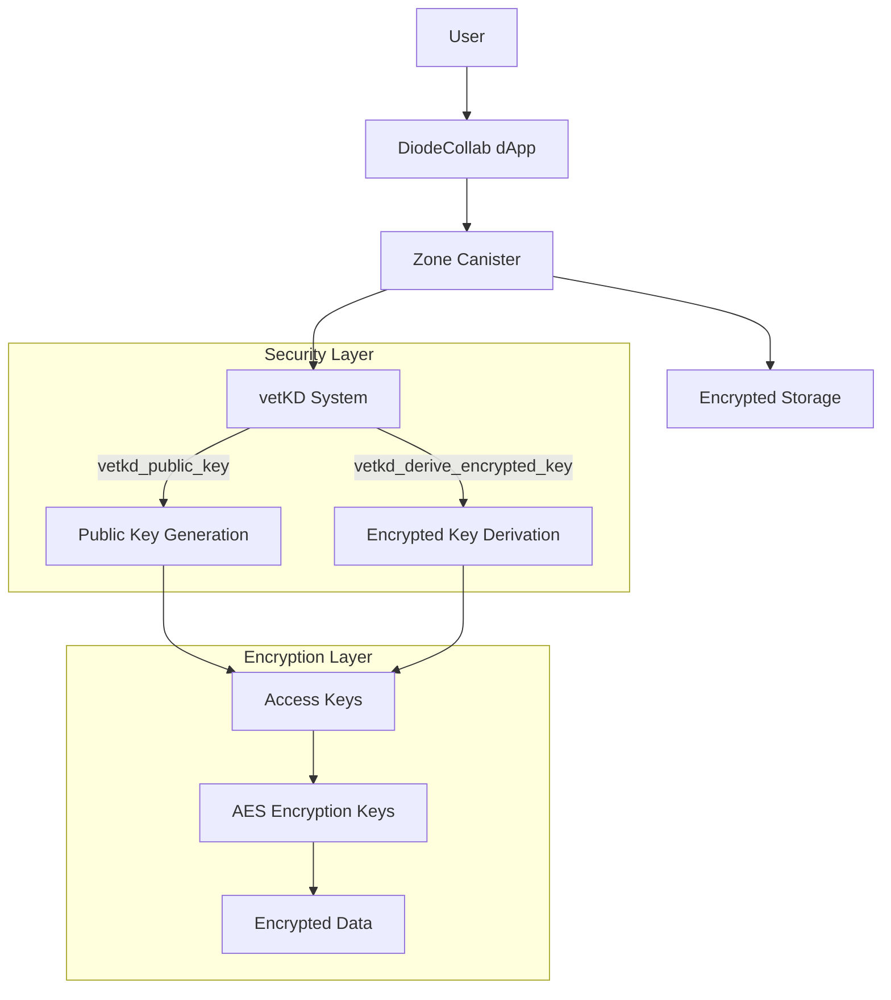
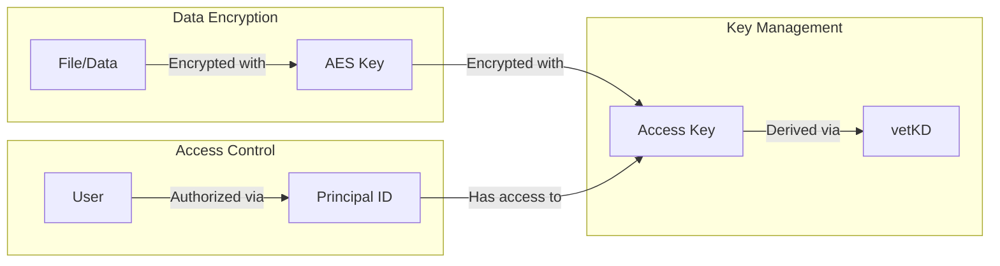
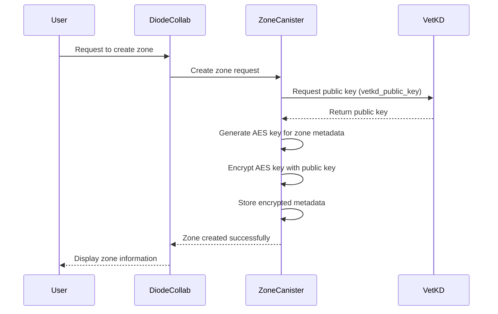
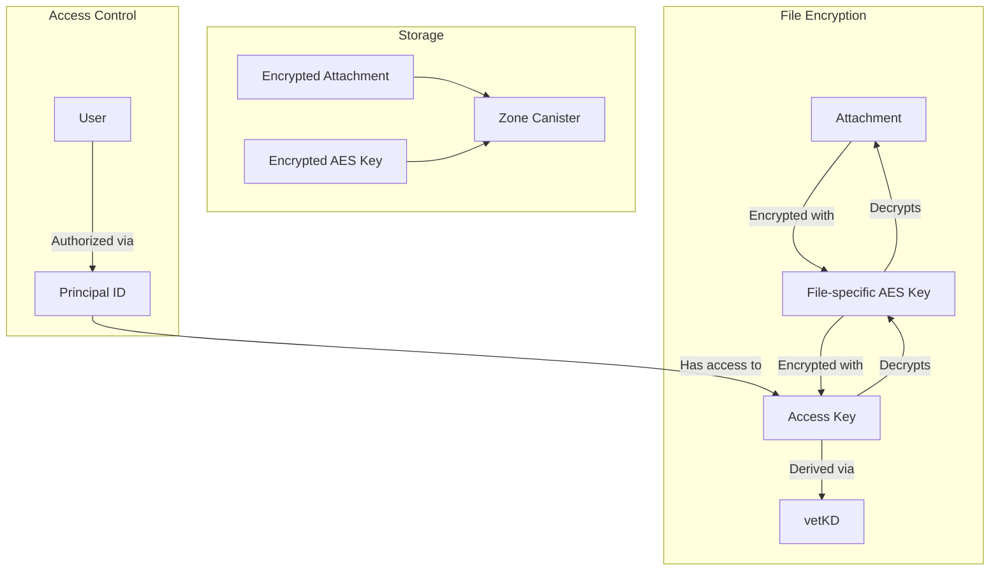
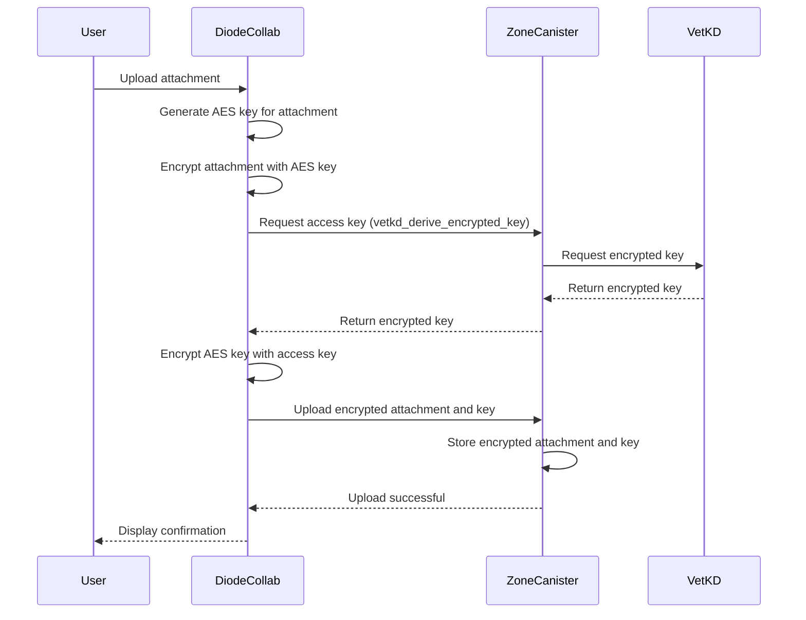
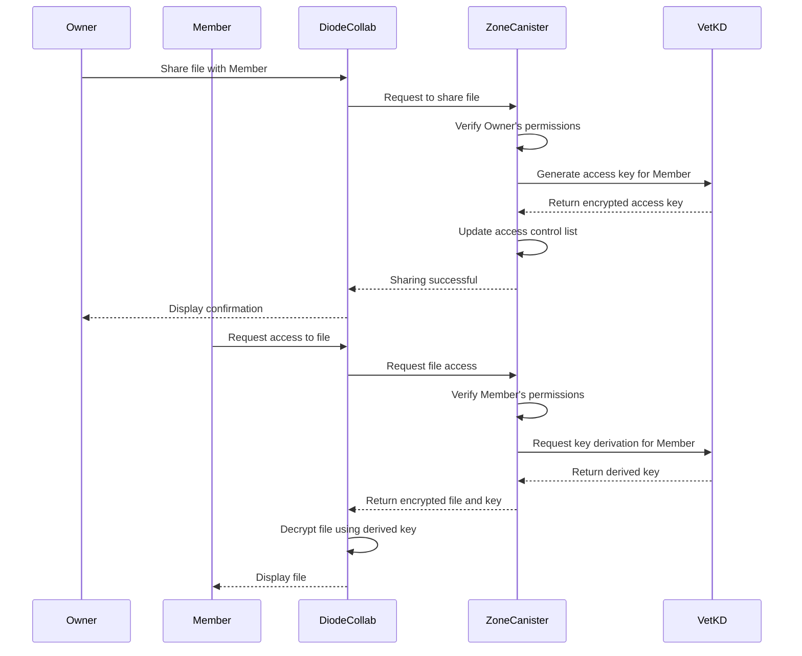
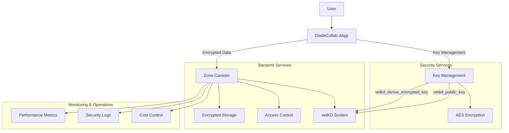
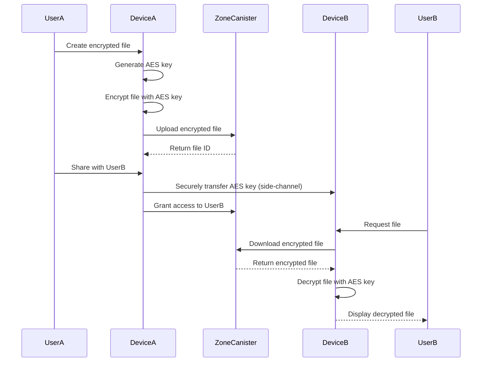

# Diode Collab: Secure File Sharing with vetKEY Integration
*Grant Size: 50,000 USD*

## Project Overview

Diode Collab is a secure file sharing application built on the Internet Computer, leveraging vetKEY technology for end-to-end encryption and secure access control. This project implements a Zone Canister system that enables teams to securely share and collaborate on files with granular access controls.

## Architecture Overview



### Key Components

1. **Zone Canister**: Manages metadata, access controls, and encrypted storage for a team workspace
2. **vetKD Integration**: Leverages the Internet Computer's vetKD system for secure key derivation
3. **Multi-layer Encryption**:
   - Data is encrypted with AES keys
   - AES keys are encrypted with access keys derived from vetKD
   - Pre-vetKD deployment: AES keys can be exchanged via secure side-channels device-to-device
   - Single key derivation on the ICP cost 0.05 €, so for cost optimization data keys can be passed off-chain
   - Access key rotation can be done quickly without needing to re-encrypt the actual data as each piece of data has it's own data encryption key, and only that data encryption key needs to be re-encrypted.
   - Trusted execution environment enhancements can this way be integrated in the future when they come to the ICP

## Security Model



## User Stories

1. **Team Admin**
   - As a team admin, I want to create a secure workspace/zone where I can control who has access to shared files
   - As a team admin, I want to assign different access levels to team members (Admin, Owner, Moderator, Member, ReadOnly)
   - As a team admin, I want to define public zone metadata such as a workspace name, short description, and branding.

2. **Team Member**
   - As a team member, I want to securely upload and share files with my team
   - As a team member, I want to access files shared with me without worrying about security breaches

3. **Content Creator**
   - As a content creator, I want to share large media files (videos, images) with specific team members
   - As a content creator, I want to revoke access to my files when a team member leaves

## Milestones

---

# Milestone #1/4 – Initial Implementation of Zone Canister Storage with Basic Metadata and Encryption Stubs

## Story

This milestone focuses on the initial technical implementation of Zone Canister storage for encrypted data exchange using vetKEY encryption stubs as provided by the vetKEY integration canister. During this phase, the Zone Canister will support "zone public" metadata (such as zone name, zone logo, etc.) encrypted by a "zone shared" key. A later milestone will include transitioning to the vetKEY production ready encryption implementation and measuring cost/performance impact.

## Deliverables
- **Initial Canister Contract**: Implemented and deployable with metadata handling and encryption stubs
- **Unit Tests & Benchmarks**: Validating metadata encryption, storage, and retrieval
- **Demo Recording**: Canister deployment and basic operations
- **vetKEY client library**: New elixir agent client library to do interact with the vetKEY transport encryption using BLS curves.

## Implementation Details
- Use the vetKEY teams publicy deployed stubs for key derivation at `s55qq-oqaaa-aaaaa-aaakq-cai`:
  ```motoko
    type VETKD_SYSTEM_API = actor {
        vetkd_public_key : ({
            canister_id : ?Principal;
            derivation_path : [Blob];
            key_id : { curve : { #bls12_381_g2 }; name : Text };
        }) -> async ({ public_key : Blob });
        vetkd_derive_encrypted_key : ({
            derivation_path : [Blob];
            derivation_id : Blob;
            key_id : { curve : { #bls12_381_g2 }; name : Text };
            encryption_public_key : Blob;
        }) -> async ({ encrypted_key : Blob });
    };

    let vetkd_system_api : VETKD_SYSTEM_API = actor ("s55qq-oqaaa-aaaaa-aaakq-cai");
    ```

- Define data structures for zone metadata and access control
- Implement basic two-layer AES encryption key generation and storage

## Sequence Diagram



## Sprint 1 (Days 1-10): Core Storage Implementation with Metadata Handling
- Develop core canister logic and key validation functions
- Integrate with encryption stubs for key generation and metadata handling
- Review performance implications of encryption in canisters

## Sprint 2 (Days 11-20): Client Integration & Optimization
- Implement client side encryption/decryption of vetKEY BLS keys
- Ensure access controls hit correctly when members are being added / removed from a Zone Canister.
- Create end-to-end integrated test cases for metadata upload & downloads.

## Sprint 3 (Days 21-30): Testing & Performance Validation
- Test metadata upload and retrieval performance
- Benchmark encryption + storage efficiency and scalability
- Finalize implementation and documentation

---

# Milestone #2/4 – Handling Encrypted Chat Attachments

## Story

This milestone extends the Zone Canister to handle large chat attachments. Chat messages themselves have already been added to Canister storage. But large documents, files, images and other data that is being attached to chat messages is living currently out-of-band. In this milestone we're adding the large binary objects to the canister storage as well. This implementation ensures that attachments are securely stored and retrievable while maintaining encryption integrity.

## Deliverables
- **Attachment Storage Implementation**: Secure storage of large encrypted files
- **Unit Tests & Performance Metrics**: Attachment retrieval benchmarks
- **Demo Recording**: Showing attachment storage and retrieval in action

## Implementation Details
- Implement per-file AES encryption key generation
- Encrypt AES keys using access keys derived from vetKD
- Define storage structure for encrypted attachments with partitioning of the data during upload and download to fit the request size limits of the icp
- Implement attachment validation and access control

## Architecture Diagram



## Sequence Diagram



## Sprint 1 (Days 31-40): Implementation of Secure Attachment Storage
- Define storage structure for encrypted attachments
- Implement attachment validation and metadata handling
- Research cost impact of storing encrypted attachments

## Sprint 2 (Days 41-50): Scalability & Cost Benchmarking
- Benchmark attachment storage efficiency
- Define policies for large attachments and auto-pruning
- Implement performance optimizations

## Sprint 3 (Days 51-60): Testing & Finalization
- Conduct security and access validation
- Optimize retrieval speed for encrypted files
- Finalize documentation and prepare for integration

---

# Milestone #3/4 – Full vetKEY Integration & Large Data Handling Policies

## Story

This milestone ensures that the Zone Canister handles all shared and privately shared data with proper vetKEY encryption while implementing policies for handling large files efficiently.

## Deliverables
- **Full vetKEY Integration**: All shared data is encrypted using vetKEYs
- **Scalability Optimization Policies**: Implemented strategies for large data handling
- **Demo Recording**: Showcasing secure data sharing and pruning policies
- **Technical Documentation**: Detailed explanation of the encryption architecture

## Implementation Details
- Transition from encryption stubs to full vetKEY implementation
- Implement role-based access control (Admin, Owner, Moderator, Member, ReadOnly)
- Define policies for handling large files and automatic pruning
- Implement secure key rotation mechanisms

## Sequence Diagram for Secure Sharing



## Sprint 1 (Days 61-70): Final Encryption Implementation
- Transition from encryption stubs to full vetKEY encryption
- Implement encryption handling for shared/private data
- Benchmark encryption cost

## Sprint 2 (Days 71-80): Large Data Handling & Cost Optimization
- Implement policies for large file warnings and automatic pruning
- Research and optimize data storage costs
- Test retrieval efficiency for large-scale data

## Sprint 3 (Days 81-90): Security & Performance Validation
- Validate encryption integrity and access control
- Optimize performance for large-scale file sharing
- Finalize documentation and demo preparations

---

# Milestone #4/4 – App Integration & Production Launch

## Story

The final milestone ensures that all features are integrated into the Diode Collab app, optimized for production deployment, and launched with a staged rollout.

## Deliverables
- **Production-Ready Release**: Final canister and app integration
- **Automated Monitoring**: Performance metrics and security logging
- **Cost Mitigation Strategies**: Finalized policies for storage and processing efficiency
- **Final Demo Recording**: Showcasing the complete functionality
- **User Documentation**: Comprehensive guides for end users

## Implementation Details
- Implement UI components for seamless user experience
- Integrate DiodeCollab with the secure storage backend
- Implement monitoring and alerting for security and performance
- Finalize user documentation and support materials

## Architecture Diagram (Full System)



## Sprint 1 (Days 91-100): Full App Integration
- Implement UI components for seamless user interaction
- Finalize API integration with storage mechanisms
- Ensure smooth user experience for file uploads/downloads

## Sprint 2 (Days 101-110): Deployment Preparation & Scalability Validation
- Deploy system monitoring and logging tools
- Final testing on cost-efficient operations
- Ensure compliance with scalability best practices

## Sprint 3 (Days 111-120): Staged Rollout & Monitoring
- Perform a staged rollout and monitor adoption
- Implement alerts and fail-safe mechanisms for cost control
- Finalize documentation and support materials

---

## Alternative Pre-vetKEY Deployment Approach

During the development phase or in environments where vetKEY is not yet available, the system can operate using secure side-channel key exchange:



This approach ensures security even before the full vetKEY system is deployed, allowing for early testing and validation of the core functionality. 