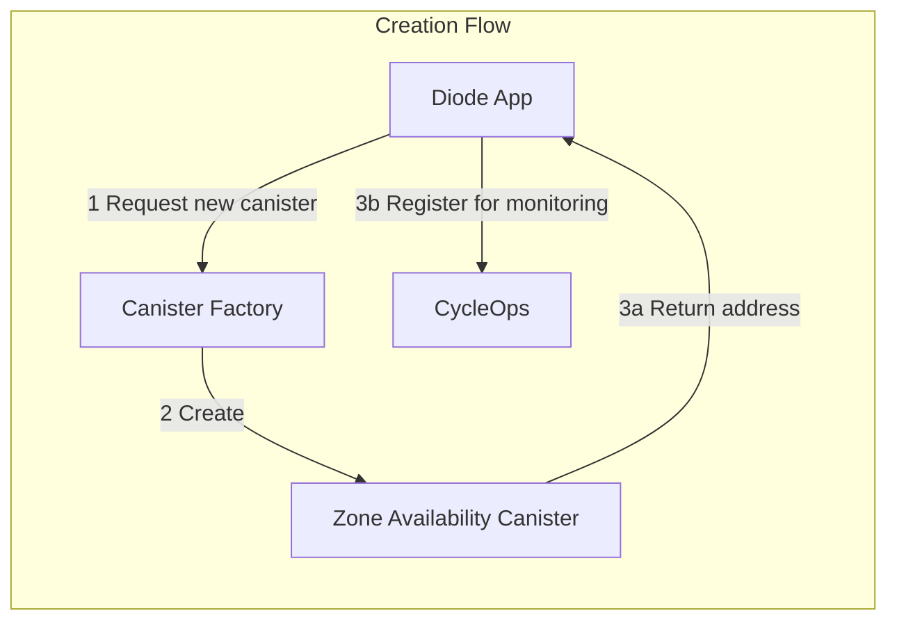
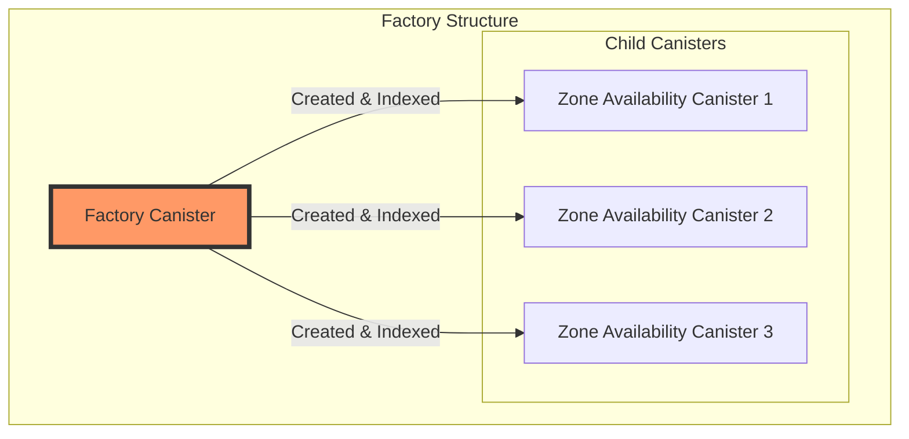
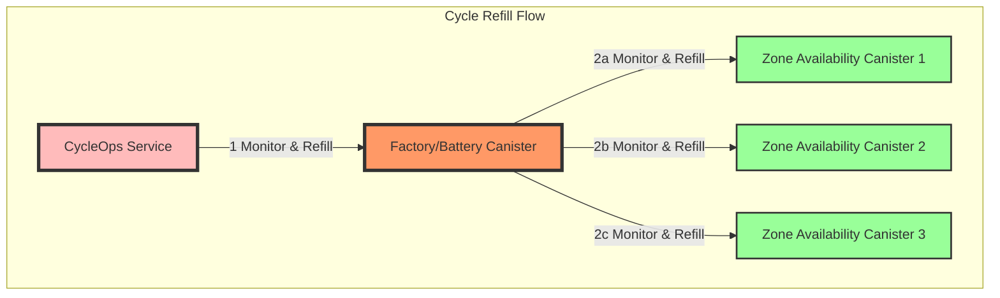

# Diode Message Canister - Milestone 3 Architecture

This canister is used as availability guarantee for the Diode peer to peer messaging system. When a peer tries to send a message to another peer which is currently offline the Canister will be used as temporary storage.

In Milestone 3 the canister will be integrated into the production Diode App as backend for message storage.

## Requirements

- Handle data cleanup logic when canister size limit is reached
- Design monitoring for cycle consumption and refill logic
- Auto-Create new canister clones per Diode Zone
- Test Diode App UI integration with test group of people

## Architecture

#### Flow 1: Creation of a new zone availability canister from the Diode App on zone creation

This first flow shows the creation process for new zone availability canisters. Since each zone availability canister should be self-custodial to the zone and it's owners each canister is created independently using a canister factory. It is an important property of the system that each zone availability canister is under full custody (full control and cost management) of the zone and it's owners.

1. Diode App sends request for a new zone availability canister to the canister factory
2. Canister factory spawns a new zone availability canister (zac)
3. Diode App receives the new canister address and registers it for monitoring with cycle ops.

#### Flow 2: Cycle management and refill

The relationship between the factory canister and the child canisters is that the factory canister is responsible for creating and indexing the child canisters. This closely resembles the setup proposed by CycleOps in their cycles-manager project repo: https://github.com/CycleOperators/cycles-manager/

In our case the factory canister is also acting as the "Battery" canister the child canisters by default allowing them to be refilled by the factory canister. The factory by itself, controlled by the Diode Team will be refilled through the CycleOps service.

## Factory Canister (also Battery Canister)

The factory canister is a simple canister that is responsible for creating new zone availability canisters. It is a singleton canister that is deployed once and then used to create new zone availability canisters.

The factory canister is responsible for the following:

1. Creating new zone availability canisters
2. Keeping track of all the zone availability canisters that have been created
3. Returning the address of the newly created zone availability canister to the Diode App

Concerns and Open Questions for future development:

- Will having a single factory limit all child canisters to the same subnet? Might this create a bottleneck and if yes how to address it?
- How to update child contracts
    => Upgrade vs Replace. Why is the motoko upgrade process so underdocumented? E.g. why is post-install() called with the constructor arguments?
    => Can we re-use a single WASM multiple times? (pointer to code vs code by value)
    => Is there a native code versioning system? (We added get_version() to the canisters)

- Oracle pass through of transform function (because it needs to be a shared actor anchored function instead of just a function)
- Event-push instead of query polling
- Cost considerations. Deploying one canister at 1.5 TC is ~2 USD per canister.
    - How to best track cycle consumption of the canister fleet over time?
- Mops still doesn't support newer pocket-ic required to run http tests

## Cycle Management

For now we intend to integrate with the cycle ops service to monitor the cycle consumption of the canister factory only, while the child canisters will be refilled by the factory canister itself.

## Additional contributions

- https://github.com/diodechain/icp_agent An elixir agent for the ICP network.
- https://github.com/diodechain/candid An elixir encoder/decoder for the ICP Candid serialization format.
- https://github.com/diodechain/leb128 Elixir implementation of the LEB128 encoding/decoding for ICP.